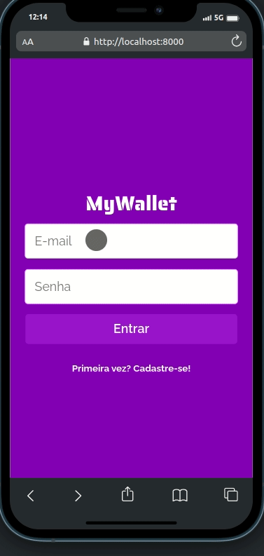

<h1>MyWallet</h1>

MyWallet é uma aplicação de carteira que permite aos usuários realizar o cadastro e login, além de adicionar e gerenciar suas movimentações financeiras de entrada e saída para manter uma visibilidade clara de seus gastos e saldo total. Os principais recursos incluem o cadastro e login de usuários, o registro de movimentações com valores e descrições, a edição de movimentações, a exclusão de movimentações e a visualização do saldo total.

<h2>Demo</h2>

<h3>Tecnologias e Ferramentas</h3>

Este projeto foi desenvolvido utilizando as seguintes tecnologias e ferramentas:

- ***React***: Uma biblioteca JavaScript para construir interfaces de usuário interativas e reativas.
- ***Axios***: Uma biblioteca para fazer requisições HTTP em aplicativos JavaScript, facilitando a comunicação com servidores.
- ***Material-UI (mui/material)***: Uma biblioteca de design e componentes prontos para uso com base nas diretrizes de Material Design do Google.
- ***Styled Components***: Uma biblioteca para estilizar componentes React usando JavaScript e CSS dentro dos próprios componentes.
- ***Local storage***: Uma API do navegador que permite armazenar dados de forma persistente no navegador do usuário, útil para armazenar informações localmente no lado do cliente.

<h3>Pré-requisitos</h3>

Para executar a aplicação MyWallet, é necessário ter um backend compatível. Você pode encontrar o backend correspondente neste repositório: <a href="https://github.com/csjhonathan/mywallet-back">MyWallet Backend</a> . Além disso, é necessário ter o NodeJs instalado na sua máquina, caso não tenha, <a href="https://nodejs.org/pt-br">clique aqui</a> para baixar.

<h3>Deploy</h3>

A aplicação MyWallet está disponível online. Você pode acessá-la <a href="https://projeto14-mywallet-front-fawn-omega.vercel.app/">aqui</a>.

<h3>Configuração</h3>

Antes de executar a aplicação, você precisará configurar as variáveis de ambiente necessárias. Para fazer isso, siga estas etapas:

**Clone o repositório MyWallet**:

`git clone https://github.com/seu-usuario/mywallet-front.git`

**Navegue até a pasta do projeto**:

`cd mywallet-front`

Crie um arquivo `.env` baseado no arquivo `.env.example` fornecido e preencha as variáveis de ambiente necessárias com suas configurações específicas.

**Instale as dependências do projeto**:

`npm install`

<h3>Executando a Aplicação</h3>

Após configurar as variáveis de ambiente e instalar as dependências, você pode iniciar a aplicação MyWallet com o seguinte comando:

`npm start`

Abra o seu navegador favorito e navegue até http://localhost:3000/ , onde a aplicação estará disponível por padrão.
